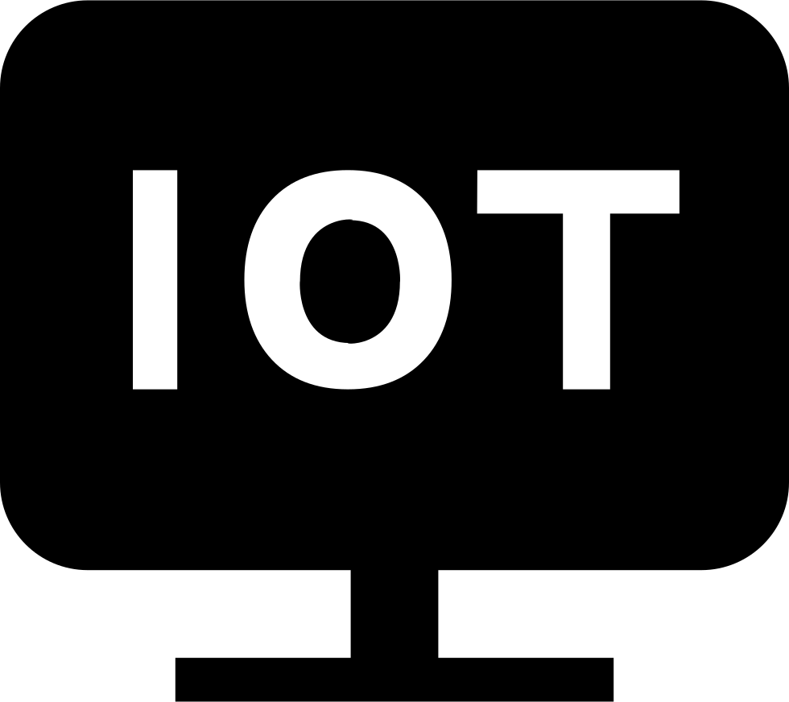

Following samples demonstrate how to use the `Streaming Runtime` to implement various streaming and event-driven use case scenarios:

* { align=left, width="25"} [Anomaly Detection](./anomaly-detection/anomaly-detection.md) - detect, in real time, suspicious credit card transactions, and extract them for further processing.
* { align=left, width="25"} [Clickstream Analysis](clickstream/clickstream.md) -   for an input clickstream stream, we want to know who are the high status customers, currently using the website so that we can engage with them or to find how much they buy or how long they stay on the site that day.
* { align=left, width="20"} [IoT Monitoring analysis](iot-monitoring/iot-monitoring.md) - real-time analysis of IoT monitoring log.
* { align=left, width="20"} [Streaming Music Service](top-k-songs/top-k-songs.md) - music ranking application that continuously computes the latest Top-K music charts based on song play events collected in real-time.
* ... more to come
