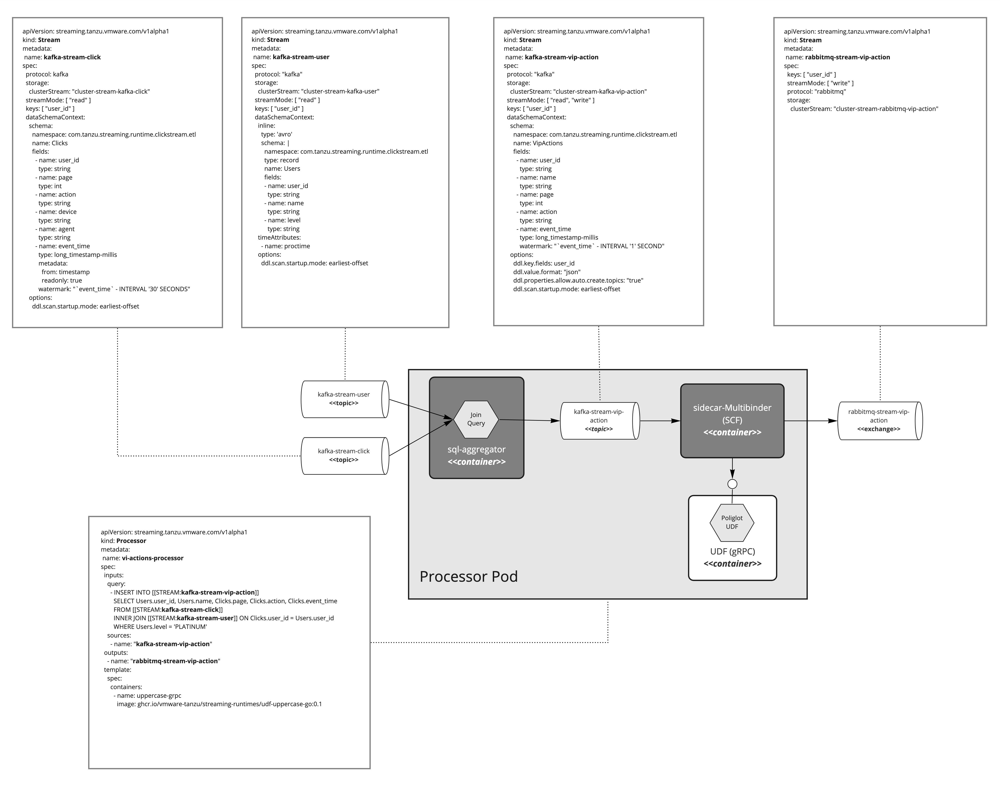

# Clickstream Analysis

## Overview

The Streaming ETL is a common place for many people to begin first when they start exploring the streaming data processing. 
With the streaming ETL we get some kind of data events coming into the streaming pipeline, and we want intelligent analysis to go out the other end.

Let's just say `clickstream` data is coming in, and we want to know who are our high status customers who are currently using the website
so that we can engage with them or to find how much they buy or how long they stay on the site that day.


> `Clickstream` data is the pathway that a user takes through their online journey. 
> For a single website it generally shows how the user progressed from search to purchase. 
> The clickstream links together the actions a single user has taken within a single session. 
> This means identifying where a search, click or purchase was performed within a single session.

Let say that our streaming ETL, receives two input streams of data:

the `Users` stream - containing detailed information about the registered users:

```json
{"user_id":"407-41-3862","name":"Olympia Koss","level":"SILVER"}
{"user_id":"066-68-4140","name":"Dr. Leah Daniel","level":"GOLD"}
{"user_id":"722-61-1415","name":"Steven Moore","level":"GOLD"}
{"user_id":"053-26-9971","name":"Karine Boyle","level":"SILVER"}
{"user_id":"795-35-5070","name":"Dr. Akiko Hoppe","level":"PLATINUM"}
{"user_id":"164-85-7495","name":"Kassie Homenick","level":"SILVER"}
...
```

and the `Clicks` - the stream of click events: 

```json
{"user_id":"170-65-1094","page":5535,"action":"selection","device":"computer","agent":"Mozilla/5.0 (Windows NT 10.0; WOW64) AppleWebKit/537.36 (KHTML, like Gecko) Chrome/56.0.2924.87 Safari/537.36 OPR/43.0.2442.991"}
{"user_id":"804-31-3496","page":30883,"action":"checkout","device":"tablet","agent":"Mozilla/4.0 (compatible; MSIE 7.0; Windows NT 6.0)"}
{"user_id":"011-54-8948","page":18877,"action":"products","device":"mobile","agent":"Mozilla/5.0 (iPhone; CPU iPhone OS 11_4_1 like Mac OS X) AppleWebKit/605.1.15 (KHTML, like Gecko) Version/11.0 Mobile/15E148 Safari/604.1"}
{"user_id":"854-27-6546","page":64282,"action":"selection","device":"mobile","agent":"Mozilla/5.0 (Windows NT 10.0; WOW64; rv:50.0) Gecko/20100101 Firefox/50.0"}
{"user_id":"719-81-5311","page":54344,"action":"product_detail","device":"mobile","agent":"Mozilla/5.0 (Windows NT 5.1; rv:7.0.1) Gecko/20100101 Firefox/7.0.1"}
{"user_id":"263-22-2309","page":28687,"action":"products","device":"mobile","agent":"Mozilla/5.0 (iPhone; CPU iPhone OS 12_0_1 like Mac OS X) AppleWebKit/605.1.15 (KHTML, like Gecko) Version/12.0 Mobile/15E148 Safari/604.1"}
```
> Note the JSON format is optional. For real scenarios Apache Avro is most likely to be used

Then we can define a streaming query that continuously analyses the two input streams and produces a new stream containing only enriched information for the Platinum level users.

```sql
1. INSERT INTO VipActions
2.      SELECT 
3.         Users.user_id, Users.name, Clicks.page, Clicks.action, Clicks.event_time 
4.      FROM 
5.         Clicks
6.      INNER JOIN 
7.         Users ON Clicks.user_id = Users.user_id  
8.      WHERE 
9.         Users.level = 'PLATINUM'
```

The first line (`1`) creates a new VIP Actions stream and a new Kafka topic. 
The query is going to run and never stop until we kill it.
The new stream is created as an ordinary SQL select (`2`) from a stream called `Clicks` (`5`) joined to a stream called `Users` (`6-7`).
Since the `Clicks` and `Uers` streams have both a `user_id` we can join them to get a new stream that's the clickstream data enriched with the user data.

We are only interested in platinum-level users. This the user-level information is not available in the Clicks stream, but as we were able to join to the Users stream now we can filter based on the Users data (`8-9`).

Following diagram illustrates the implementation flow and involved resources:



## Quick start

- Install the streaming-runtime operator:
```shell
kubectl apply -f 'https://raw.githubusercontent.com/vmware-tanzu/streaming-runtimes/main/streaming-runtime-operator/install.yaml' -n streaming-runtime
```

- Install the anomaly detection streaming application:
```shell
kubectl apply -f 'https://raw.githubusercontent.com/vmware-tanzu/streaming-runtimes/main/streaming-runtime-operator/samples/clickstream/clickstream-etl.yaml' -n streaming-runtime
```

- Install the authorization attempts random data stream:

```shell
kubectl apply -f 'https://raw.githubusercontent.com/vmware-tanzu/streaming-runtimes/main/streaming-runtime-operator/samples/clickstream/data-generator.yaml' -n default
```

* Delete the Top-k songs pipeline and the demo song generator:
```shell
kubectl delete srs,srcs,srp --all -n streaming-runtime 
kubectl delete deployments -l app=clickstream-data-generator
```

